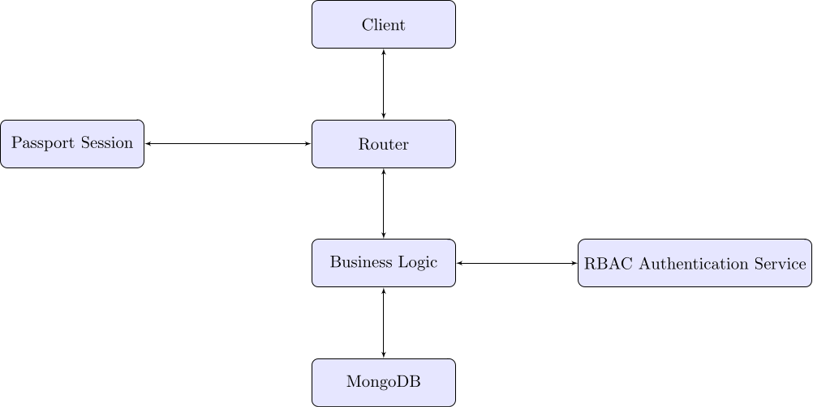

# Scelte implementative

## Back-end

Le **componenti** del backend sono associate **per funzionalità** piuttosto che per funzione: cioè le funzionalità del progetto (item, visite, musei) sono raccolte in **moduli** che espongono le proprie funzioni; piuttosto che raggruppare elementi di domini diversi per funzione (routing, logica, api endpoints).

Si assicura la correttezza della logica e delle composizioni di funzioni grazie al sistema di tipi di **TypeScript**. Per fare ciò abbiamo definito varie strutture dati: dai modelli di **mongoose**, passando per errori stessi, fino a generare schemi di oggetti JSON in **Zod**. Quest'ultima scelta implementativa usa Zod per modellare i tipi di input provenienti dalle richiese API (in formato JSON), ma soprattuto sfrutta la capacità di Zod di **validare** un dato input dato uno schema. Infine si assicura, e si forza, la **gestione statica degli errori** attraverso i tipi di dato algebrici (ADT), implementati dalla libreria **purify-ts**.

### Access control

Per un controllo primario basato sulla coppia **Permesso**-**Ruolo\***, addottiamo la seguente politica:
| Azione\Ruolo | Visitatore | Utente | Creatore | Guida | Amministratore |

|-------------------|------------|--------|----------|-------|----------------|
| Visualizza item | | ✓ | ✓ | ✓ | ✓ |
| Visualizza museo | ✓ | ✓ | ✓ | ✓ | ✓ |
| Visualizza tour | ✓ (meta) | ✓ | ✓ | ✓ | ✓ |
| Acquista tour | | ✓ | ✓ | ✓ | ✓ |
| Crea tour/item | | | ✓ | | ✓ |
| Modifica tour | | | ✓ | | ✓ |
| Elimina tour | | | ✓ | | ✓ |
| Gestione gruppo | | | | ✓ | ✓ |
| Sincronizza nav. | | | | ✓ | ✓ |
| Assegna quiz | | | | ✓ | ✓ |
| Visualizza utenti | | | | | ✓ |
| Modifica tutto | | | | | ✓ |

Passato questo test, si validano altre proprietà specifiche. Ad esmepio: la necessità di aver acquistato una visita per visualizzarla. Il meccanismo è implementato attraverso la consultazione di una matrice che definisce le politiche di accesso (auspicabilmente simile alla tabella qui riportata).
